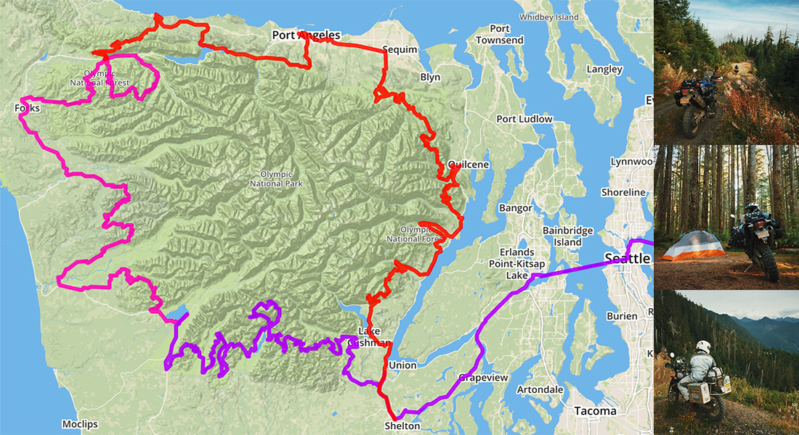
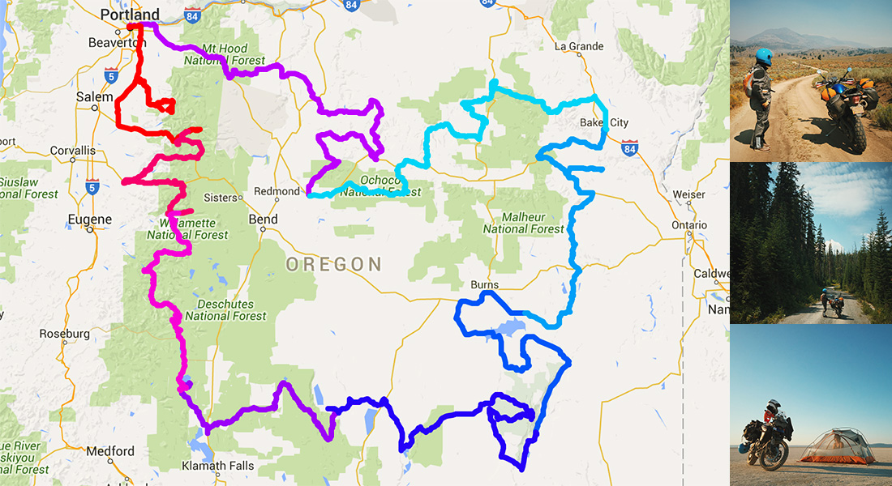

# Adventure Tracks

Hi! In this repository lives the GPS tracks for trips I've taken on [my motorcycle](http://chrshnt.com/my-tiger). You are free to download and ride these yourself and can find photos from most of these trips on my Instagram account: [instagram.com/huntca](https://instagram.com/huntca/).

Download the [gpx archive](https://github.com/chrishunt/tracks/tree/gh-pages/gpx) and peruse in your GPS viewer of choice, or pull up [a map](http://chrishunt.co/tracks/map.html?2015-09-12,ff0000&2015-09-13,ff00b4&2015-09-14,ae00ff) using the URL syntax I've described below.

[](https://instagram.com/huntca/)

## Examples

Here's a scenic loop around the Olympic Peninsula in Washington that was ridden from `2015-09-12` to `2015-09-14`. Notice that I've included color information in the URL as well. If a color is not specified, we'll choose a random one for you.

```
http://chrishunt.co/tracks/map.html?
  2015-09-12,ff0000&
  2015-09-13,ff00b4&
  2015-09-14,ae00ff
```

[](http://chrishunt.co/tracks/map.html?2015-09-12,ff0000&2015-09-13,ff00b4&2015-09-14,ae00ff)

And here's a loop around Oregon that was toured with my wife in August 2015. The tracks have been given different colors here so each day can be seen clearly.

```
http://chrishunt.co/tracks/map.html?
  2015-08-07,ff0000&
  2015-08-08,f4006d&
  2015-08-09,f400d4&
  2015-08-10,9b00f4&
  2015-08-11,2800f4&
  2015-08-12,005cf4&
  2015-08-13,00a1f4&
  2015-08-14,00d4f4&
  2015-08-15,ba00ff
```

Alternatively, if we didn't care about the colors of the tracks, we could fetch this trip with a date range instead.

```
http://chrishunt.co/tracks/map.html?2015-08-07..2015-08-15
```

[](http://chrishunt.co/tracks/map.html?2015-08-07,ff0000&2015-08-08,f4006d&2015-08-09,f400d4&2015-08-10,9b00f4&2015-08-11,2800f4&2015-08-12,005cf4&2015-08-13,00a1f4&2015-08-14,00d4f4&2015-08-15,ba00ff)

## Adding tracks

1. Separate and export each day's tracks into its own file using your tool of choice. I like to download and edit tracks using [Garmin's Basecamp](http://www.garmin.com/en-US/shop/downloads/basecamp).
1. Add the date of the track to the exported filename (`2015-10-12.gpx`).
1. Import the track using the script provided.

```bash
# This reduces the track to 1,000 points, copies it to /gpx, and adds an entry
# to the track index.
$ ./bin/import-track /path/to/YYYY-MM-DD.gpx
```

## Adding photos

1. Resize the photos to 400px and export at 60% jpg to reduce filesize.
1. Add the date of the photo and number suffix to the filename (`2015-10-10-1.jpg`).
1. Move photos to `photos/`
1. Refresh photo list with provided script.

```bash
# This extracts the GPS information from every photo in photos/ and rebuilds
# the photo list in js/photos.js
$ ./bin/refresh-photos
```
